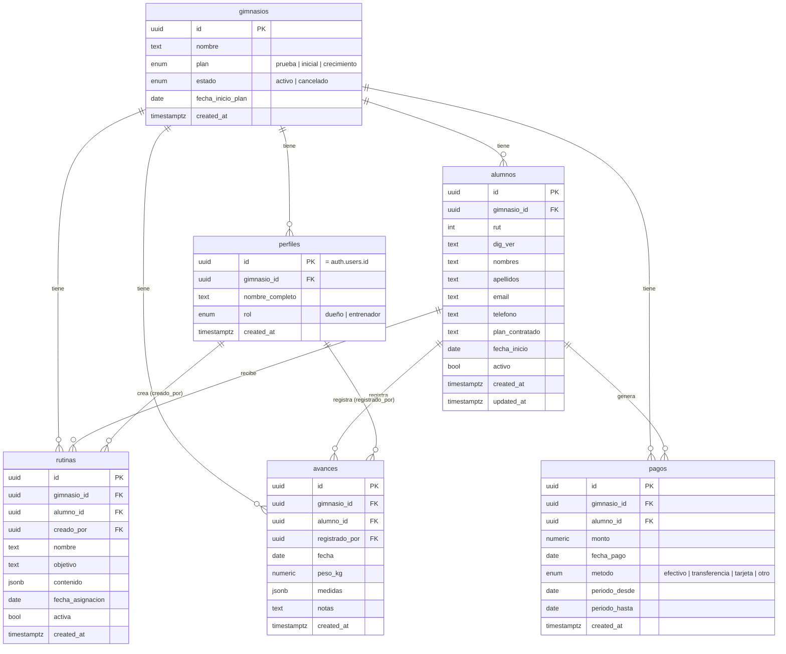

# Modelo de tablas — Supabase (proyecto `wslzbejanltdnsbqcfvj`)

> Generado consultando directamente la base de datos Postgres del proyecto (`information_schema`, `pg_catalog`) el 2026-08-21. Refleja el estado **real** en Supabase, no solo lo que hay en `supabase/migrations/`.
>
> **Nota (Sprint 13, 2026-09-01):** este documento no se actualizó completo desde el
> Sprint 5 — no cubre `reservas`/`horarios_disponibles` (Sprint 8), `paquetes`
> (Sprint 9), `superadmins` (Sprint 12), etc. (ver esas migraciones directamente en
> `supabase/migrations/`). Solo se actualizaron acá las tablas que tocó el Sprint 13:
> `planes` (nueva), `registros_rutina` (nueva) y las columnas nuevas/eliminadas de
> `alumnos`.
>
> **Nota (Sprint 14, 2026-09-01):** se agregó `rutina_plantillas` (catálogo,
> nueva), y las columnas `rutinas.plantilla_id`, `pagos.plan_id` y el índice único
> `planes_nombre_unq` — ver migración `0010_ajustes_post_sprint_13.sql`.

## ⚠️ Drift detectado vs. migraciones locales

Las migraciones locales (`0001_modelo_negocio.sql`, `0002_alta_gimnasio.sql`) **no** cubren todo lo que existe en la base:

- Tabla **`members`** — no está en ninguna migración. Nombres de columna en inglés (`full_name`, `phone`, `membership_plan`, `status`...), sin relación (FK) con `gimnasios`. Tiene 0 filas. Parece un remanente de un ejemplo/plantilla de Supabase (Table Editor "Quickstart") y no forma parte del modelo de negocio real (que usa `alumnos`). **Candidata a eliminar** si se confirma que no se usa.
- Vista **`v_estado_pago_alumnos`** — no está en ninguna migración, existe solo en la base.
- Función/trigger **`set_updated_at`** sobre `alumnos.updated_at` — tampoco está en las migraciones locales.

Recomendación: exportar estos tres objetos a una migración `0003_drift_produccion.sql` (o vía `supabase db pull`) para que el repo quede como fuente de verdad, y decidir si `members` se elimina.

## Diagrama ER



## Tablas

### `gimnasios` — tenant raíz (multi-tenant por gimnasio)

| Columna | Tipo | Null | Default |
|---|---|---|---|
| id | uuid (PK) | no | `gen_random_uuid()` |
| nombre | text | no | — |
| plan | enum `plan_gimnasio` | no | `'prueba'` |
| estado | enum `estado_gimnasio` | no | `'activo'` |
| fecha_inicio_plan | date | no | `CURRENT_DATE` |
| created_at | timestamptz | no | `now()` |

Enums: `plan_gimnasio` = `prueba, inicial, crecimiento` · `estado_gimnasio` = `activo, cancelado`

### `perfiles` — usuarios de la app, 1:1 con `auth.users`

| Columna | Tipo | Null | Default |
|---|---|---|---|
| id | uuid (PK, FK → `auth.users.id`) | no | — |
| gimnasio_id | uuid (FK → `gimnasios.id`) | no | — |
| nombre_completo | text | no | — |
| rol | enum `rol_perfil` | no | `'dueño'` |
| created_at | timestamptz | no | `now()` |

Enum: `rol_perfil` = `dueño, entrenador`

### `alumnos`

| Columna | Tipo | Null | Default |
|---|---|---|---|
| id | uuid (PK) | no | `gen_random_uuid()` |
| gimnasio_id | uuid (FK → `gimnasios.id`) | no | — |
| rut | integer | no | — |
| dig_ver | text (check `^[0-9K]$`) | no | — |
| nombres | text | no | — |
| apellidos | text | no | — |
| email | text | sí | — |
| telefono | text | sí | — |
| plan_id | uuid (FK → `planes.id`, `on delete set null`) | sí | — |
| fecha_inicio | date | no | `CURRENT_DATE` |
| activo | boolean | no | `true` |
| puede_registrar_bitacora | boolean | no | `false` |
| created_at | timestamptz | no | `now()` |
| updated_at | timestamptz | no | `now()` (actualizado por trigger `trg_alumnos_updated_at`) |

Constraint único: `(gimnasio_id, rut)` — un RUT no se repite dentro del mismo gimnasio.
Índice: `idx_alumnos_gimnasio(gimnasio_id)`.

**Sprint 13:** `plan_contratado` (texto libre) se eliminó y se reemplazó por `plan_id`
(FK a `planes`) — ver migración `0009_catalogo_planes_bitacora.sql`. También agrega
`puede_registrar_bitacora` (además de las columnas de roles/aprobación/ficha de salud
de los Sprints 8/9/12 que este documento tampoco cubre todavía, ver nota arriba).

### `planes` — catálogo de planes por gimnasio (Sprint 13)

| Columna | Tipo | Null | Default |
|---|---|---|---|
| id | uuid (PK) | no | `gen_random_uuid()` |
| gimnasio_id | uuid (FK → `gimnasios.id`) | no | — |
| nombre | text | no | — |
| nivel | enum `nivel_plan` | no | — |
| precio | numeric(10,2) | sí | — |
| dias_por_semana | smallint (check `> 0`) | no | — |
| fecha_vigencia_desde | date | no | `CURRENT_DATE` |
| fecha_vigencia_hasta | date (null = vigente indefinido) | sí | — |
| creado_por | uuid (FK → `perfiles.id`) | sí | — |
| modificado_por | uuid (FK → `perfiles.id`) | sí | — |
| created_at | timestamptz | no | `now()` |
| updated_at | timestamptz | no | `now()` |

Enum: `nivel_plan` = `basico, intermedio, avanzado`. Define cuántos días a la semana
entrena el alumno — separado de la Rutina (contenido de entrenamiento), sin pantalla
combinada. `dias_por_semana` determina las clases incluidas del paquete que origina
un pago (`dias_por_semana × 4`) y el tope de reservas del alumno (trigger
`reservas_check_paquete` sobre `reservas`, ver migración 0009).

**Sprint 14:** nombre único por gimnasio (case/espacio-insensible), reforzado con el
índice `unique index planes_nombre_unq on planes (gimnasio_id, lower(trim(nombre)))`.
El pago que renueva un período ahora elige el plan directamente (en vez de tipear un
n° de clases) — si el plan elegido difiere del que el alumno tiene hoy, el mismo pago
actualiza `alumnos.plan_id` (upgrade/downgrade).

### `rutina_plantillas` — catálogo de plantillas de rutina por gimnasio (Sprint 14)

| Columna | Tipo | Null | Default |
|---|---|---|---|
| id | uuid (PK) | no | `gen_random_uuid()` |
| gimnasio_id | uuid (FK → `gimnasios.id`) | no | — |
| nombre | text | no | — |
| categoria | enum `categoria_rutina_plantilla` | no | `'general'` |
| objetivo | text | sí | — |
| contenido | jsonb (array de ejercicios, mismo shape que `rutinas.contenido`) | no | `'[]'` |
| creado_por | uuid (FK → `perfiles.id`) | sí | — |
| modificado_por | uuid (FK → `perfiles.id`) | sí | — |
| created_at | timestamptz | no | `now()` |
| updated_at | timestamptz | no | `now()` |

Enum: `categoria_rutina_plantilla` = `musculacion, cardio, general`. Es el catálogo
reutilizable que arma el dueño una vez — sin policy de alumno, no se expone al
portal. Asignar una plantilla a un alumno (desde su ficha, Alumnos → Editar) copia
`contenido` como snapshot a una nueva fila de `rutinas` con `plantilla_id` seteado
(ver abajo) — editar la plantilla después no reescribe el historial de alumnos que
ya la tuvieron asignada.

### `registros_rutina` — bitácora de sesiones de rutina (Sprint 13)

| Columna | Tipo | Null | Default |
|---|---|---|---|
| id | uuid (PK) | no | `gen_random_uuid()` |
| gimnasio_id | uuid (FK → `gimnasios.id`) | no | — |
| alumno_id | uuid (FK → `alumnos.id`) | no | — |
| rutina_id | uuid (FK → `rutinas.id`) | no | — |
| ejercicio_index | smallint | no | — |
| ejercicio | text (snapshot del nombre) | no | — |
| series_planificadas | smallint (snapshot) | sí | — |
| reps_planificadas | smallint (snapshot) | sí | — |
| series_realizadas | smallint | sí | — |
| reps_realizadas | smallint | sí | — |
| peso_kg | numeric(6,2) | sí | — |
| fecha | date | no | `CURRENT_DATE` |
| registrado_por | uuid (FK → `perfiles.id`, null si lo registró el alumno) | sí | — |
| origen | enum `origen_cambio` (`dueño, alumno`) | no | `'dueño'` |
| notas | text | sí | — |
| created_at | timestamptz | no | `now()` |

Una fila por ejercicio dentro de cada sesión. Lo planificado queda "congelado" como
snapshot al momento del registro (no se reescribe si luego se edita la rutina).
Índice: `idx_registros_rutina_alumno_fecha(alumno_id, fecha)`. RLS: el alumno solo
puede insertar sus propias filas con `origen = 'alumno'`, `fecha = current_date` y
`puede_registrar_bitacora = true` (reforzado en base, no solo en el formulario).

### `pagos`

| Columna | Tipo | Null | Default |
|---|---|---|---|
| id | uuid (PK) | no | `gen_random_uuid()` |
| gimnasio_id | uuid (FK → `gimnasios.id`) | no | — |
| alumno_id | uuid (FK → `alumnos.id`) | no | — |
| monto | numeric(10,2) | no | — |
| fecha_pago | date | no | `CURRENT_DATE` |
| metodo | enum `metodo_pago` | no | `'efectivo'` |
| periodo_desde | date | no | — |
| periodo_hasta | date | no | — |
| created_at | timestamptz | no | `now()` |

Enum: `metodo_pago` = `efectivo, transferencia, tarjeta, otro`
Índice: `idx_pagos_alumno_periodo(alumno_id, periodo_hasta)` — usado por la vista de estado de pago.

**Sprint 14:** agrega `plan_id` (uuid, FK → `planes.id`, `on delete set null`,
nullable) — snapshot del plan elegido en ese pago; `null` para pagos que no
originan un paquete (ej. un ajuste).

### `rutinas` — registro de asignación (plantilla copiada a un alumno)

| Columna | Tipo | Null | Default |
|---|---|---|---|
| id | uuid (PK) | no | `gen_random_uuid()` |
| gimnasio_id | uuid (FK → `gimnasios.id`) | no | — |
| alumno_id | uuid (FK → `alumnos.id`) | no | — |
| creado_por | uuid (FK → `perfiles.id`) | sí | — |
| plantilla_id | uuid (FK → `rutina_plantillas.id`, `on delete set null`) | sí | — |
| nombre | text | no | — |
| objetivo | text | sí | — |
| contenido | jsonb (array de ejercicios) | no | `'[]'` |
| fecha_asignacion | date | no | `CURRENT_DATE` |
| activa | boolean | no | `true` |
| created_at | timestamptz | no | `now()` |

Índice: `idx_rutinas_alumno_activa(alumno_id, activa)`.
Forma de `contenido` observada en datos reales: `[{ ejercicio, series, reps, notas }]`.

**Sprint 14:** `rutinas` deja de ser donde el dueño arma el contenido directamente —
ahora es el registro de **asignación** de una plantilla de `rutina_plantillas` a un
alumno en una fecha (snapshot de `contenido`, igual que antes). `plantilla_id` es
trazabilidad, `null` para rutinas creadas antes de este sprint (quedan "sin
plantilla de origen", sin perder su snapshot). La bitácora (`registros_rutina`) y el
portal del alumno siguen leyendo `rutinas` sin cambios.

### `avances` — seguimiento físico del alumno

| Columna | Tipo | Null | Default |
|---|---|---|---|
| id | uuid (PK) | no | `gen_random_uuid()` |
| gimnasio_id | uuid (FK → `gimnasios.id`) | no | — |
| alumno_id | uuid (FK → `alumnos.id`) | no | — |
| registrado_por | uuid (FK → `perfiles.id`) | sí | — |
| fecha | date | no | `CURRENT_DATE` |
| peso_kg | numeric(5,2) | sí | — |
| medidas | jsonb | no | `'{}'` |
| notas | text | sí | — |
| created_at | timestamptz | no | `now()` |

Índice: `idx_avances_alumno_fecha(alumno_id, fecha)`. Sin filas todavía (funcionalidad no usada en producción aún).

### `members` — ⚠️ no forma parte del modelo de negocio, ver nota de drift arriba

| Columna | Tipo | Null | Default |
|---|---|---|---|
| id | uuid (PK) | no | `gen_random_uuid()` |
| full_name | text | no | — |
| email | text (unique) | sí | — |
| phone | text | sí | — |
| membership_plan | text | no | `'mensual'` |
| start_date | date | no | `CURRENT_DATE` |
| end_date | date | sí | — |
| status | text | no | `'activo'` |
| created_at | timestamptz | sí | `now()` |

Sin FK a `gimnasios` — no es multi-tenant. 0 filas.

## Vista

### `v_estado_pago_alumnos`

```sql
SELECT a.id AS alumno_id, a.gimnasio_id, a.nombres, a.apellidos, a.activo,
       max(p.periodo_hasta) AS vencimiento_actual,
       CASE
         WHEN max(p.periodo_hasta) >= CURRENT_DATE THEN 'al_dia'
         WHEN max(p.periodo_hasta) IS NULL THEN 'sin_pagos'
         ELSE 'atrasado'
       END AS estado_pago
FROM alumnos a
LEFT JOIN pagos p ON p.alumno_id = a.id
GROUP BY a.id, a.gimnasio_id, a.nombres, a.apellidos, a.activo;
```

Calcula el estado de pago de cada alumno (`al_dia` / `atrasado` / `sin_pagos`) tomando el último `periodo_hasta` pagado.

## Función / trigger

`set_updated_at()` — trigger `BEFORE UPDATE` en `alumnos` que fija `updated_at = now()` en cada modificación.

## Seguridad — Row Level Security (RLS)

RLS está **habilitado en las 7 tablas**. Modelo: cada perfil pertenece a un `gimnasio_id`; casi todas las políticas filtran por `gimnasio_id IN (SELECT gimnasio_id FROM perfiles WHERE id = auth.uid())`, aislando los datos entre gimnasios (multi-tenant).

| Tabla | Política | Comando | Regla |
|---|---|---|---|
| `gimnasios` | acceso por pertenencia | SELECT | `id` está entre los gimnasios del perfil del usuario |
| `gimnasios` | alta por usuario autenticado | INSERT | cualquier usuario autenticado puede crear un gimnasio (alta / onboarding) |
| `perfiles` | acceso propio | ALL | `id = auth.uid()` — cada usuario solo ve/edita su propio perfil |
| `alumnos` | acceso por gimnasio | ALL | `gimnasio_id` del alumno debe coincidir con el del perfil |
| `pagos` | acceso por gimnasio | ALL | ídem |
| `rutinas` | acceso por gimnasio | ALL | ídem |
| `avances` | acceso por gimnasio | ALL | ídem |
| `members` | staff acceso total | ALL | `auth.role() = 'authenticated'` — cualquier usuario logueado, sin aislar por tenant |

Esto explica por qué en `.env.local` solo hay una `publishable key`: el aislamiento de datos se hace 100% vía RLS + `auth.uid()`, no hay claves separadas por tenant.
